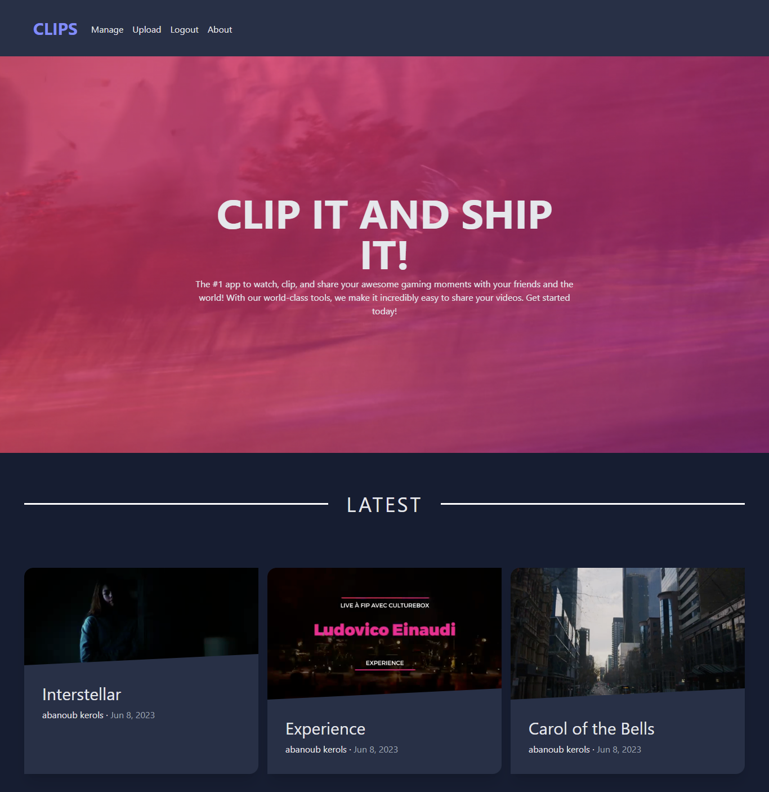
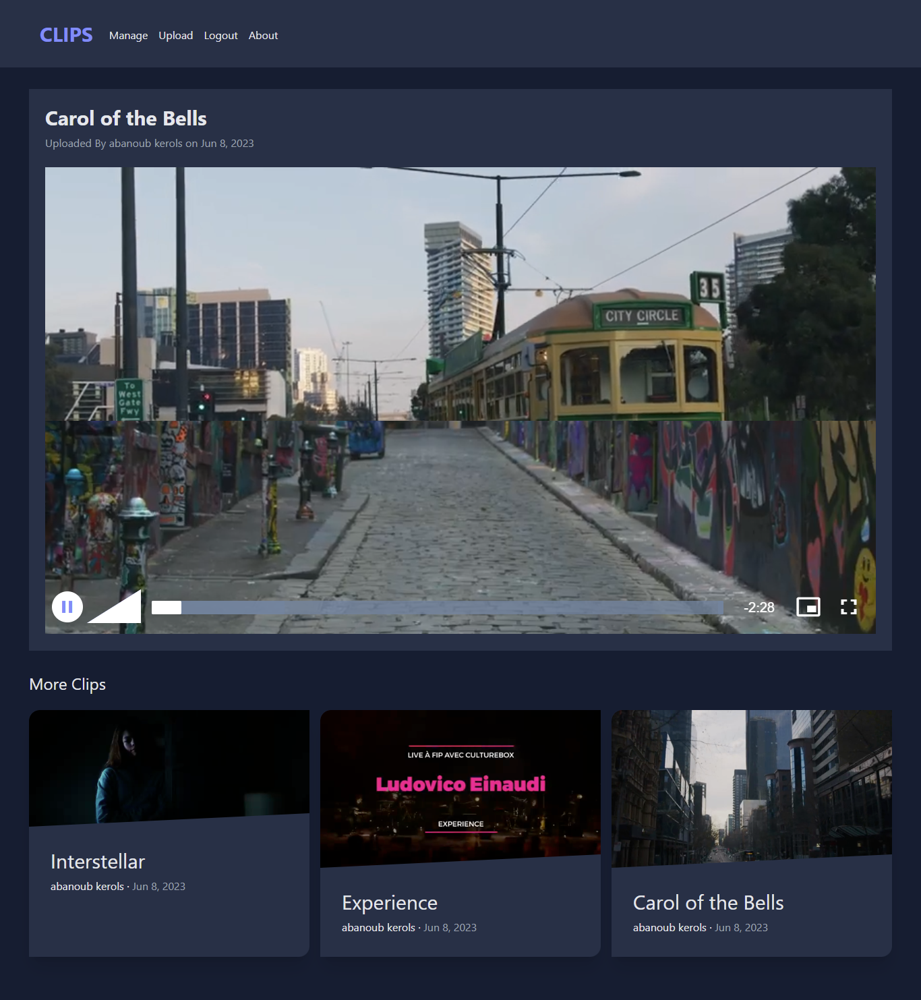
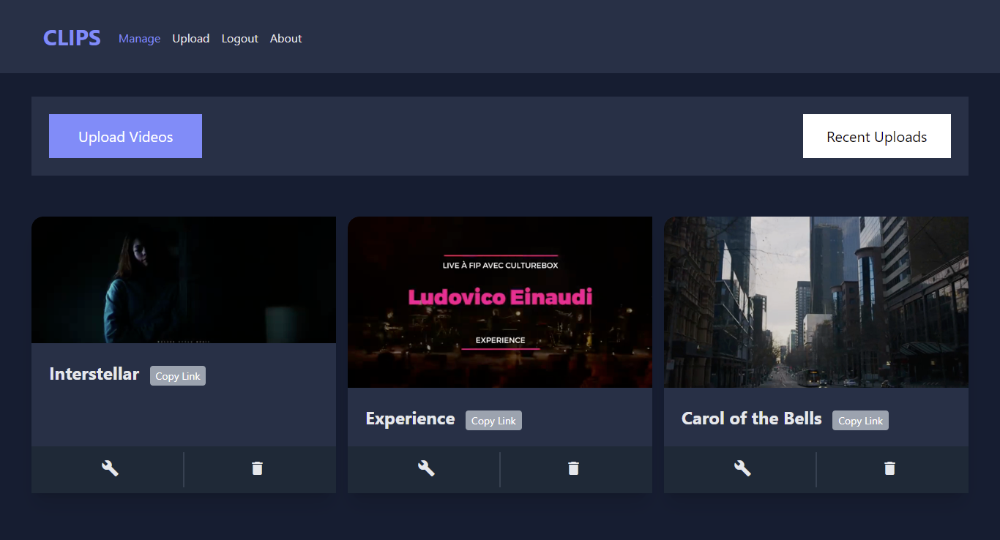
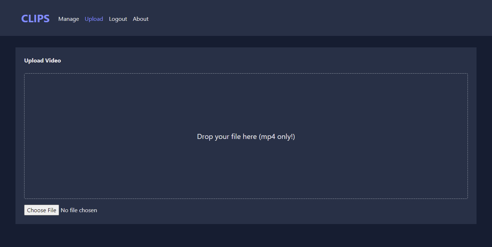

# video_game_clip_store_with_ANGULAR
video_game_clip_store_with_ANGULAR

video_game_clip_store
<h1>Full Stack App 👉 Angular - FireBase </h1>
<h3><a href="https://abanoubkerols-video-game-clip-store-with-angular.vercel.app/">Project Link</a></h3>
<h3>tools used in Project </h3>
<ul>
 <li>angular routing</li>
 <li>angular guards </li>
 <li>angular service</li>
 <li>angular reactive forms</li>
 <li>pipes</li>
 <li>directives</li>
</ul>
<h3>Features of project</h3>
<ul>
 <li>Upload Video</li>
 <li>Delete Video</li>
 <li>Edit Video</li>
 <li>Show Video</li>

</ul>

